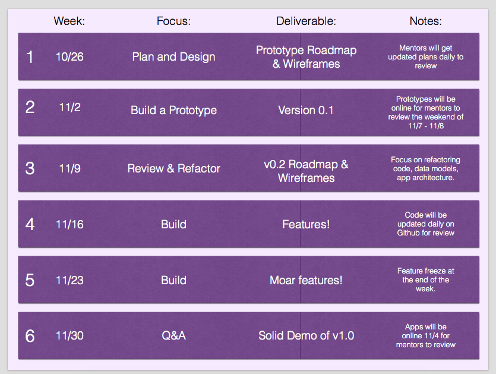

# Introduction
Welcome to the Project Phase. For the next six weeks you will be working in teams to build advanced functional apps. To do this well, your team will need to work together effectively.

Elements to effective collaboration for software development:

1. Create detailed plans before writing any code.
2. Divide responsibilities clearly.
3. Communicate often.
4. ... I bet you can think of more!

Here is a timeline for the next six weeks. 

 

The following chapters describe each week more in